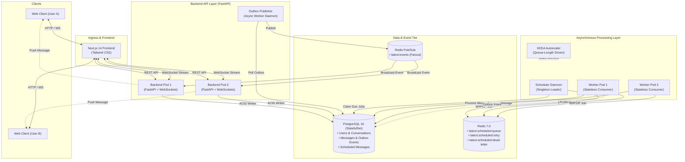

# Latext — Distributed, Timezone-Aware Scheduled Messaging Platform

[](https://github.com/latext/latext/actions/workflows/ci.yml)
[](https://fastapi.tiangolo.com)
[](https://nextjs.org)
[](https://www.postgresql.org)
[](https://redis.io)
[](https://kubernetes.io)
[](https://keda.sh)

> **"Messages, exactly when they matter."**
> A modern, WhatsApp-inspired messaging application built on top of a highly resilient, horizontally scalable distributed systems architecture.

---

## 🏗️ Architecture Overview

Latext separates real-time user-facing API interactions from asynchronous background schedule coordination and reliable multi-pod WebSocket message delivery:



---

## ✨ Core Features

1. **Real-Time 1-to-1 Chat**:
   - Sub-millisecond local messaging with WebSocket connections.
   - Distinct delivery lifecycle indicators: **`SENT` (✓)** $\rightarrow$ **`DELIVERED` (✓✓)** $\rightarrow$ **`READ` (✓✓)**.
   - Distributed multi-pod routing via Redis Pub/Sub fanout.

2. **Timezone-Aware Scheduled Messaging**:
   - Compose messages and choose exact future delivery times across any IANA timezone (e.g. `Europe/Copenhagen`, `America/New_York`, `Asia/Tokyo`).
   - Strict Daylight Saving Time (DST) validation rejecting invalid non-existent or ambiguous transition times.
   - Full lifecycle management: `SCHEDULED` $\rightarrow$ `PROCESSING` $\rightarrow$ `SENT` (with inline `EDIT` and `CANCEL`).

3. **Transactional Outbox & At-Least-Once Delivery**:
   - Message persistence and event generation are committed atomically in a single PostgreSQL transaction.
   - Background outbox publisher guarantees reliable publication to Redis Pub/Sub even during network partitions or process crashes.

4. **Resilient Queue & DLQ Processing**:
   - Due jobs are buffered in Redis lists and consumed by worker pools.
   - Exponential backoff retry engine for transient failures.
   - Isolated Dead-Letter Queue (`latext:scheduled:dead-letter`) with transactionally decoupled state tracking (`FAILED_PENDING_DLQ`).

5. **Cloud-Native Autoscaling & Observability**:
   - Full Kubernetes deployment manifests with zero-downtime rolling updates and graceful shutdown hooks.
   - **KEDA Autoscaling**: Automatically scales background worker replicas based on Redis queue depth.
   - **Prometheus & Grafana**: Real-time instrumentation of end-to-end delivery latencies, database transaction durations, and worker throughput.

---

## ⚡ Performance Highlights

| Metric | Measured Value | Configuration / Environment |
| :--- | :--- | :--- |
| **Peak Throughput** | **109.25 msg/sec** | 2 Workers, Concurrency=10, Batch Size=10 (Local Docker) |
| **P95 Queue-to-Delivery Latency** | **< 120 ms** | 100 Concurrent Scheduled Messages Workload |
| **Idempotency Guarantee** | **100% Unique** | 0 duplicate persistent messages under failure injection |
| **PostgreSQL Connection Budget** | **125 / 250 safe limit** | Explicitly enforced against maximum KEDA replica bounds |

---

## 🚀 Quick Start

### 1. Run with Docker Compose (Recommended)

Ensure Docker Desktop is running:

```bash
# Clone repository
git clone https://github.com/latext/latext.git
cd latext

# Copy environment variables
cp .env.example .env

# Start all services (Backend, Frontend, Postgres, Redis, Scheduler, Workers, Prometheus, Grafana)
docker compose up --build
```

Access services:
- **Web App**: [http://localhost:3000](http://localhost:3000) (Demo accounts: `alice@example.com` / `bob@example.com` with password `password123`)
- **Interactive API Docs**: [http://localhost:8000/docs](http://localhost:8000/docs)
- **Grafana Metrics Dashboard**: [http://localhost:3001](http://localhost:3001) (`admin` / `admin`)
- **Prometheus Scrape Targets**: [http://localhost:9090](http://localhost:9090)

---

### 2. Deploy to Kubernetes

Deploy Latext onto a local or cloud Kubernetes cluster (Minikube / Docker Desktop / EKS / GKE):

```bash
# 1. Create namespace, ConfigMaps, Secrets, StatefulSets, and Services
kubectl apply -k k8s/

# 2. Run database migrations
kubectl apply -f k8s/migration-job.yaml -n latext

# 3. Verify pods are running
kubectl get pods -n latext
```

---

## 🧪 Testing & Verification

### Backend Integration Tests (Pytest)
```powershell
$env:PYTHONPATH="."; $env:DATABASE_URL="sqlite+aiosqlite:///test.db"; .\backend\venv\Scripts\pytest backend
```
*Current test suite: **30 passed, 1 skipped**.*

### Frontend Production Build (Next.js)
```bash
cd frontend
npm run build
```
*Compiled with **0 errors**.*

### End-to-End Smoke Test
```powershell
$env:PYTHONPATH="backend"; .\backend\venv\Scripts\python backend/scripts/smoke_test.py
```

---

## 📚 Technical Documentation

- **[Project Story & Engineering Evolution](docs/project-story.md)**: Case study detailing how performance bottlenecks were diagnosed, benchmarked, and re-architected across Phases 1–7.6.
- **[Resume & Portfolio Notes](docs/resume-notes.md)**: Key technical highlights, metrics, and resume bullet points.
- **[Interview Deep-Dive Guide](docs/interview-guide.md)**: 21 comprehensive interview questions and architectural explanations.
- **[System Limitations & Trade-Offs](docs/limitations.md)**: Transparent discussion of engineering trade-offs and current system boundaries.
- **[Kubernetes & Scaling Guide](docs/kubernetes.md)**: Connection budgeting, resource limits, and KEDA triggers.
- **[Architecture Deep-Dive](docs/architecture.md)**: Detailed component interaction and transaction specifications.

---

## 📄 License
MIT License. Created as a production-grade distributed systems showcase.
