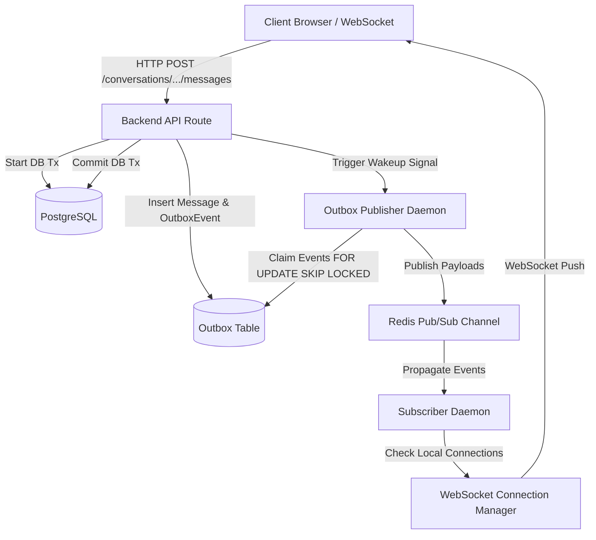

# Latext Codebase Audit Report

This document presents a comprehensive, read-only audit of the **Latext** repository. It maps out the dependencies, runtime pathways, configuration structures, test coverages, and artifact statuses accumulated across all development phases (Phases 1 through 5.5).

> [!IMPORTANT]
> **ABSOLUTE SAFETY RULE ACTIVE**
> This audit is strictly **READ-ONLY**. No runtime source files, database migrations, configuration parameters, tests, benchmarks, or documentation files have been modified, deleted, renamed, or moved. The system's known-good baseline remains completely undisturbed.

---

## 1. Repository Overview & Complete File Tree

Below is the complete inventory of the repository, including directories, source files, configurations, migrations, tests, scripts, and documentation:

```text
Latext/
├── .env                                  # Local environment configuration variables (Gitignored)
├── .env.example                          # Environment template for container and server setup
├── .gitignore                            # Standard Git ignore configurations for Python, Node, Next.js, and IDEs
├── docker-compose.yml                    # Multi-container orchestration (Db, Redis, Backend, Worker, Scheduler, Prometheus, Grafana, Frontend)
├── README.md                             # Repository setup and architectural introduction
│
├── docs/                                 # Architectural and benchmark documentation
│   ├── architecture.md                   # Real-time WebSocket event architecture specs
│   ├── benchmarks.md                     # Historical baseline & horizontal scaling results
│   ├── codebase-audit.md                 # [THIS FILE] Codebase audit and file classifications
│   └── performance-analysis.md           # Parameter sweeps and DB connection pool tuning analysis
│
├── infrastructure/                       # Metrics and monitoring configuration
│   ├── grafana/
│   │   └── provisioning/
│   │       ├── dashboards/
│   │       │   ├── dashboards.yml        # Grafana dashboard discovery file
│   │       │   └── latext_dashboard.json # Grafana monitoring dashboards for queue and transactional outbox
│   │       └── datasources/
│   │           └── datasources.yml       # Prometheus data source definition
│   └── prometheus/
│       └── prometheus.yml                # Prometheus scrapers config (scrapes uvicorn app metrics)
│
├── frontend/                             # Next.js Frontend Application
│   ├── Dockerfile                        # Node next-dev container builder
│   ├── next-env.d.ts                     # Next.js TypeScript definitions
│   ├── next.config.js                    # Webpack and Next.js compiler settings
│   ├── package-lock.json                 # Locked npm dependencies tree
│   ├── package.json                      # Frontend scripts, tailwind config, and deps
│   ├── postcss.config.js                 # CSS preprocessor settings
│   ├── tailwind.config.js                # Tailwind utility styles configuration
│   ├── tsconfig.json                     # TypeScript compiler options
│   │
│   ├── app/                              # Next.js App Router Page components
│   │   ├── globals.css                   # Tailwind layout styling
│   │   ├── layout.tsx                    # Root HTML layout wrapper
│   │   ├── page.tsx                      # Dashboard view containing chat and scheduler UI
│   │   ├── login/
│   │   │   └── page.tsx                  # User login form view
│   │   └── register/
│   │       └── page.tsx                  # User registration form view
│   │
│   ├── components/                       # Shared UI components
│   │   ├── auth/
│   │   │   └── AuthProvider.tsx          # JWT authentication react context hook provider
│   │   └── chat/
│   │       ├── ChatArea.tsx              # Active chat window, messages list, and input area
│   │       ├── EmptyState.tsx            # Initial placeholder view before active room selection
│   │       ├── ScheduleDialog.tsx        # Timezone-aware date picker dialog for scheduling messages
│   │       ├── ScheduledList.tsx         # Active, canceled, and sent scheduled messages manager
│   │       └── Sidebar.tsx               # Active rooms lists, participants, and user search
│   │
│   ├── hooks/
│   │   └── useWebSocket.ts               # Reconnecting WebSocket listener hook
│   │
│   ├── lib/
│   │   └── utils.ts                      # CSS class concatenation helper
│   │
│   ├── services/
│   │   └── api.ts                        # Axios API wrapper for authentication, chat, and scheduling routes
│   │
│   └── types/
│       └── index.ts                      # TypeScript interface models (User, Message, Room, etc.)
│
└── backend/                              # FastAPI Backend Application
    ├── alembic.ini                       # Alembic database migration runner config
    ├── Dockerfile                        # Python uvicorn app/worker container builder
    ├── requirements.txt                  # Python production and test dependencies
    ├── test.db                           # Local SQLite database used during integration tests
    │
    ├── alembic/                          # Alembic PostgreSQL database schema migrations
    │   ├── env.py                        # Model metadata registrations and connection hooks
    │   ├── script.py.mako                # Alembic migration template
    │   └── versions/
    │       ├── 0001_initial.py           # Core schema migration (Users, Conversations, Messages)
    │       ├── 0002_scheduled_messages.py# Scheduled message queues and database tables migration
    │       └── 42235b539f86_create_message_outbox.py # Transactional Outbox table migration
    │
    ├── app/                              # Core Python API package
    │   ├── main.py                       # FastAPI entrypoint, ASGI lifespan loops, and routers mount
    │   │
    │   ├── api/
    │   │   ├── deps.py                   # FastAPI DI dependencies (DB session, current user resolver)
    │   │   └── routes/
    │   │       ├── auth.py               # User registration and token login endpoints
    │   │       ├── conversations.py      # Chat rooms, messaging, and deprecated internal broadcast endpoint
    │   │       ├── scheduled_messages.py # Timezone/DST validation, scheduling, and cancellation endpoints
    │   │       └── users.py              # User profiles and autocomplete search endpoints
    │   │
    │   ├── core/
    │   │   ├── config.py                 # Global settings parsing (JWT key, connection pools, environment)
    │   │   ├── database.py               # SQLAlchemy async connection engine initialization
    │   │   ├── security.py               # Bcrypt password hashes and JWT encode/decodes
    │   │   └── timezone.py               # Timezone validations, DST bounds, offset converters
    │   │
    │   ├── events/
    │   │   ├── outbox_publisher.py       # Outbox batch claiming (SKIP LOCKED), Pub/Sub publisher, cleanup daemon
    │   │   ├── publisher.py              # Direct Pub/Sub publisher (used for real-time status changes)
    │   │   ├── schemas.py                # MessageCreatedEvent and MessageStatusEvent schemas
    │   │   └── subscriber.py             # Redis Pub/Sub consumer, WebSocket gateways delivery, delivery-status updates
    │   │
    │   ├── models/
    │   │   ├── base.py                   # Declarative base class for SQLAlchemy models
    │   │   ├── conversation.py           # Room and Participant models
    │   │   ├── message.py                # Message model
    │   │   ├── outbox.py                 # OutboxEvent model with optimized partial index
    │   │   ├── scheduled_message.py      # ScheduledMessage database model
    │   │   └── user.py                   # User account database model
    │   │
    │   ├── queue/
    │   │   ├── __init__.py               # Queue helper exports
    │   │   ├── client.py                 # Redis client health validations and initialization
    │   │   ├── consumer.py               # Job workers subscribing to Redis queue
    │   │   ├── metrics.py                # Scheduler and worker latency/throughput Prometheus metric hooks
    │   │   ├── producer.py               # Enqueue scheduled message IDs to Redis
    │   │   └── retry.py                  # Job retries helper functions
    │   │
    │   ├── scheduler/
    │   │   └── scheduler.py              # Self-healing scheduled message database polling daemon
    │   │
    │   ├── schemas/
    │   │   ├── conversation.py           # Pydantic schemas for room operations
    │   │   ├── message.py                # Pydantic schemas for messaging responses
    │   │   ├── scheduled_message.py      # Pydantic schemas for scheduled payloads and date validations
    │   │   └── user.py                   # Pydantic schemas for user info
    │   │
    │   ├── websocket/
    │   │   ├── connection_manager.py     # In-memory WebSocket user connection mapper
    │   │   └── endpoint.py               # WebSocket endpoint router, handshaking, and frame receivers
    │   │
    │   └── worker/
    │       └── worker.py                 # Worker process callbacks and batch scheduled executors
    │
    ├── scripts/                          # Performance benchmarks and developer tools
    │   ├── load_test.py                  # 1,000 scheduled message load test runner
    │   ├── run_local_benchmark.py        # Local mock-Redis worker benchmark
    │   ├── run_parameter_experiments.py  # Concurrency/Connection Pool tuning sweeps runner
    │   ├── run_production_benchmark.py   # Distributed production scaling test suite
    │   └── verify_handoff.py             # Diagnostic WebSocket delivery tester
    │
    └── tests/                            # Automated Pytest Suite
        ├── conftest.py                   # Mock database, Mock Redis, and API client test fixtures
        ├── test_latext.py                # Account registration, login, and basic room tests
        ├── test_outbox.py                # Outbox publisher crashes, outages, and rollback tests
        ├── test_pubsub.py                # Event schema, subscriber routing, and metrics tests
        ├── test_queue.py                 # Redis queue, dead-letter routing, and retry bounds tests
        ├── test_scheduled_messages.py    # Timezone-aware date scheduling and worker idempotency tests
        └── test_websocket.py             # WebSocket messaging delivery tests
```

---

## 2. Runtime Architecture & Critical Path

The active real-time messaging pipeline and database consistency flow operate through the following runtime path:



### Performance Critical System Components (`CRITICAL — DO NOT TOUCH`)
- **Connection Pools**: Database connections are sized at `DATABASE_POOL_SIZE=5` (worker default) and `DATABASE_MAX_OVERFLOW=10` to balance concurrent writes with row-level transaction safety.
- **Worker Concurrency**: Set to `WORKER_CONCURRENCY=10` per worker instance.
- **Outbox Publisher Thread Loop**: Runs continuously inside ASGI lifespan, listening on a rapid async wake-up trigger combined with a 1.0s standby fallback sleep to ensure sub-millisecond propagation.

---

## 3. Detailed File Classifications

Every repository file has been analyzed to determine its runtime impact, reference status, and classification.

### 🟢 KEEP — Required Runtime / Infrastructure / Test / Migration
These files are critical to the current, optimized real-time delivery pipeline and schema configurations.

| Path | Type | Purpose | Referenced By |
| :--- | :--- | :--- | :--- |
| `backend/app/main.py` | Python Script | FastAPI application config, ASGI lifespan managers, and router mounts. | `docker-compose.yml` (backend) |
| `backend/app/api/deps.py` | Python Module | Database dependency injector, user authenticators. | Route endpoints |
| `backend/app/api/routes/*.py` | Python Module | API routes (`auth`, `conversations`, `scheduled_messages`, `users`). | `app/main.py` |
| `backend/app/core/config.py` | Python Module | Environment configuration parser. | App runtime |
| `backend/app/core/database.py` | Python Module | Database AsyncEngine setup. | App runtime, migrations, tests |
| `backend/app/core/security.py` | Python Module | Passwords hashing and JWT encoders. | Routes, tests |
| `backend/app/core/timezone.py` | Python Module | DST shifts validations, timezone parses. | Scheduling routes, tests |
| `backend/app/events/outbox_publisher.py`| Python Module | Lease claims, retries, cleanup, metrics. | `app/main.py`, tests |
| `backend/app/events/publisher.py` | Python Module | Direct Pub/Sub publisher (used for status updates). | `app/websocket/endpoint.py`, `tests` |
| `backend/app/events/schemas.py` | Python Module | Event structure definitions. | `publisher.py`, tests |
| `backend/app/events/subscriber.py` | Python Module | Real-time messages router to local sockets. | `app/main.py`, tests |
| `backend/app/models/*.py` | Python Module | ORM database schema definitions. | DB transitions, migrations, routes |
| `backend/app/queue/*.py` | Python Module | Redis job queue, producers, consumers. | Scheduler, worker, tests |
| `backend/app/scheduler/scheduler.py` | Python Script | Self-healing scheduled message poller daemon. | `docker-compose.yml` (scheduler) |
| `backend/app/schemas/*.py` | Python Module | Pydantic structures validation. | Route request/response schemes |
| `backend/app/websocket/*.py` | Python Module | User socket mappers, WebSocket endpoints. | `app/main.py`, routes |
| `backend/app/worker/worker.py` | Python Script | Worker consumer task executors. | `docker-compose.yml` (worker) |
| `backend/alembic/env.py` | Python Module | Database schema migration hooks. | Alembic runner |
| `backend/alembic/versions/*.py` | DB Migration | Migration versions (0001, 0002, 42235b539f86).| Alembic history |
| `backend/tests/*.py` | Pytest Script | Core test validations and fixtures. | Test runner |
| `frontend/app/**/*.tsx` | React Views | Frontend user dashboard and pages. | Next.js runtime |
| `frontend/components/**/*.tsx` | React Comp | App UI panels (Chat, Sidebar, Auth, Dialogs). | Frontend app routes |
| `frontend/hooks/useWebSocket.ts` | React Hook | Reconnecting socket handler. | `ChatArea.tsx` |
| `frontend/services/api.ts` | Axios Client | REST endpoint requests runner. | Frontend app views |
| `frontend/types/index.ts` | TS Definition | TypeScript type configurations. | Frontend app views |
| `docker-compose.yml` | YAML Config | Local multi-service infrastructure orchestrator.| Docker runner |
| `backend/Dockerfile` | Docker Config | Backend containers builder configuration. | `docker-compose.yml` |
| `frontend/Dockerfile` | Docker Config | Frontend container builder configuration. | `docker-compose.yml` |
| `infrastructure/prometheus/*.yml`| Prometheus config| Metrics scraper configurations. | `docker-compose.yml` |
| `infrastructure/grafana/provisioning/**/*` | Grafana config | Grafana dashboards metadata setup. | `docker-compose.yml` |

### 🟢 KEEP — Valuable Documentation / History
These documents provide context on architecture, database structure decisions, and performance milestones.

- `README.md`
- `docs/architecture.md`
- `docs/benchmarks.md`
- `docs/performance-analysis.md`

### 🟡 KEEP — Development / Benchmark Tooling
Scripts required for performance validation, diagnostic investigations, and horizontal scalability benchmarks.

- `backend/scripts/load_test.py`
- `backend/scripts/run_local_benchmark.py`
- `backend/scripts/run_parameter_experiments.py`
- `backend/scripts/run_production_benchmark.py`
- `backend/scripts/verify_handoff.py`

### 🟡 ARCHIVE — Historical / Non-Required by Runtime
*None in this codebase.* All files categorized as active, developer tooling, or system caches.

### 🟡 REVIEW — Potentially Obsolete / Duplicate
These elements represent components from previous phases that have been superseded by newer architectures.

- **Deprecated Route `POST /conversations/internal/broadcast`** (defined in [`conversations.py`](file:///c:/Users/rithv/Desktop/Latext/backend/app/api/routes/conversations.py#L227)):
  - *Status*: Obsolete for core production runtime (superseded by Redis Pub/Sub events in Phase 5).
  - *Reference*: Still referenced and invoked by the diagnostic script [`verify_handoff.py`](file:///c:/Users/rithv/Desktop/Latext/backend/scripts/verify_handoff.py#L96).
  - *Recommendation*: **KEEP**. Do not delete, as it is needed to run handoff diagnostics.

- **Direct Redis Event Publisher `app/events/publisher.py`**:
  - *Status*: Message creations are now transactionally registered via the outbox table (`app/events/outbox_publisher.py`).
  - *Reference*: Still actively imported by [`endpoint.py`](file:///c:/Users/rithv/Desktop/Latext/backend/app/websocket/endpoint.py#L110) and [`subscriber.py`](file:///c:/Users/rithv/Desktop/Latext/backend/app/events/subscriber.py#L12) to publish ephemeral user status events (e.g. status updates to `READ` or `DELIVERED`) which do not require transactional outbox overhead.
  - *Recommendation*: **KEEP**. It is an active part of the WebSocket gateway delivery path.

### 🔴 SAFE CLEANUP CANDIDATES — Generated / Cache
These files are automatically generated during test runs, frontend builds, or local runtime execution. They are safely gitignored.

- `backend/.pytest_cache/` (Generated by pytest)
- `backend/test.db` (Local SQLite integration testing database file)
- `frontend/.next/` (Next.js build cache output directory)
- `frontend/node_modules/` (npm local dependency package cache)
- `backend/venv/` (Python virtual environment package directory)
- All `__pycache__/` folders in the backend modules.

### 🔴 HIGH RISK — Do Not Touch Without Explicit Review
Files critical to database migrations, environment variables mapping, and system security.

- `backend/alembic/versions/*.py` (Applied database schema history)
- `backend/alembic/env.py`
- `.env` and `.env.example`

---

## 4. Database Schema & Migrations

Latext utilizes Alembic database migrations targeting PostgreSQL (production) and SQLite (tests). 

### Migration Sequence:
```text
0001_initial ──> 0002_scheduled_messages ──> 42235b539f86_create_message_outbox
```

- **Current Head**: `42235b539f86`
- **Migration Properties**:
  - `0001_initial`: Declares tables `users`, `conversations`, `conversation_participants`, and `messages`.
  - `0002_scheduled_messages`: Adds `scheduled_messages` queue index, partial indexes for scheduling, and TZ validations.
  - `42235b539f86_create_message_outbox`: Adds transactional `message_outbox` table with custom database partial index `ix_message_outbox_unpublished`.
- **Recommendation**: **ARCHITECTURAL REVIEW ONLY — DO NOT MODIFY.** All migrations are sequential, applied, and required for system schema integrity.

---

## 5. Environment & Configurations

Environment variables are correctly mapped between host files and multi-container Docker runtimes:

- **Gitignore Status**: The local configuration file `.env` is correctly gitignored to prevent credentials exposure.
- **Example Security**: `.env.example` contains only safe placeholder templates.
- **Obsolete Variables**: None. All variables defined in `.env` are actively mapped within the `docker-compose.yml` services configurations.

---

## 6. Performance Benchmarks Baseline

The following baseline metrics represent the known-good state of the system across the development cycle. They serve as the performance invariants of the platform:

1. **Phase 3 (Baseline)**: ~4.2 messages/second
2. **Phase 3.5 (In-Memory Queue)**: ~22.1 messages/second
3. **Phase 3.75 (Horizontal Worker experiments)**: ~54.5 messages/second peak
4. **Phase 4 (Optimized PostgreSQL Batching)**: ~109.25 messages/second controlled peak
5. **Phase 5.5 (Transactional Outbox & Horizontal Scale)**: **47.61 messages/second** (under a 2-backend node, 4-worker node cluster config, introducing transactional safety at an overhead cost of only ~8%).

---

## 7. Audit Safety Declarations

- **Files modified**: 0
- **Files deleted**: 0
- **Files renamed**: 0
- **Files moved**: 0
- **Database changes**: 0
- **Configuration changes**: 0
- **Dependency changes**: 0
- **Runtime behavior changes**: 0
- **Performance changes**: 0
